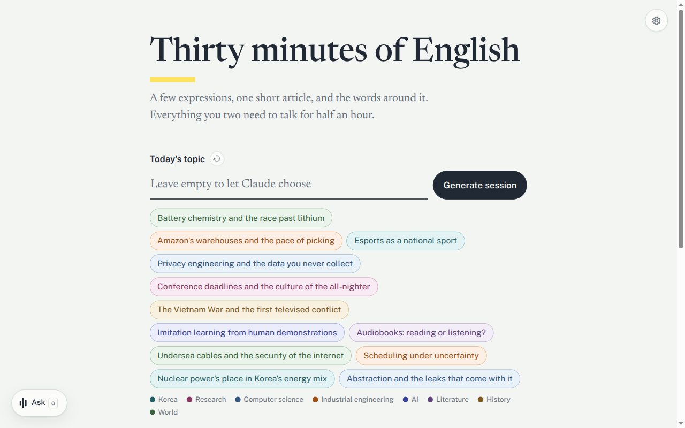
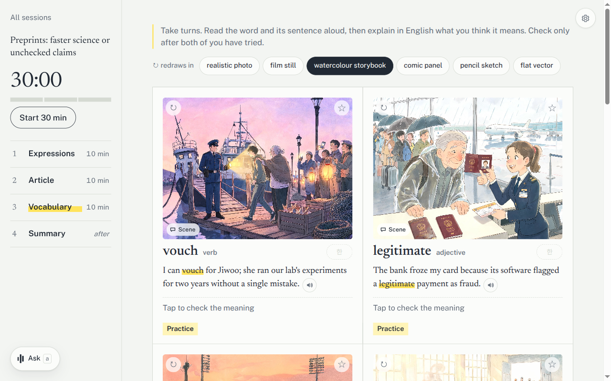

# thirty-minutes-english

Thirty minutes of English speaking practice for two people, a new session every day. Claude writes each session.



## Session

| Part | Time | What you do |
|---|---|---|
| Expressions | 10 min | Read 5 expressions aloud, then make one sentence each |
| Article | 10 min | Read a short article, summarize it, discuss 3 questions |
| Vocabulary | 10 min | Explain 10 words in English, then check the meaning |
| Summary | after | Review starred items, your sentences, and corrections |

Press `Start 30 min` and the tabs move on every 10 minutes.

## Features

- 📰 **Fresh sessions**: Claude searches the web and writes expressions, an article, and words on your topic. It skips items from recent sessions.
- 🎙️ **Voice coaches**: Read aloud marks mispronounced words and bad pauses. Ask finds the English for what you mean. Practice fixes your sentences.
- 🖼️ **Word pictures**: each word gets a picture in the style you pick.
- 🇰🇷 **Korean hints**: one tap shows the Korean meaning or a translation of the article.
- ⭐ **Summary**: everything you starred, said, or got corrected, on one page.



## Quick start

Requires Docker and a Claude subscription.

```sh
cp .env.example .env               # set CLAUDE_CODE_OAUTH_TOKEN (from `claude setup-token`)
docker compose up -d --build
```

Open http://localhost:5173.

## API keys

Only the Claude token is required. Add the other keys in the app's ⚙ settings to turn on more features.

| Key | Turns on |
|---|---|
| `CLAUDE_CODE_OAUTH_TOKEN` | Session generation (required) |
| `OPENAI_API_KEY` or `GEMINI_API_KEY` | Voice coaches |
| `AZURE_SPEECH_KEY` | Read aloud pronunciation check |
| `OPENROUTER_API_KEY` or `COMFY_API_KEY` | Word pictures |
| `FIRECRAWL_API_KEY` | Faster web search (works without it, rate-limited) |

## License

[MIT](LICENSE)
